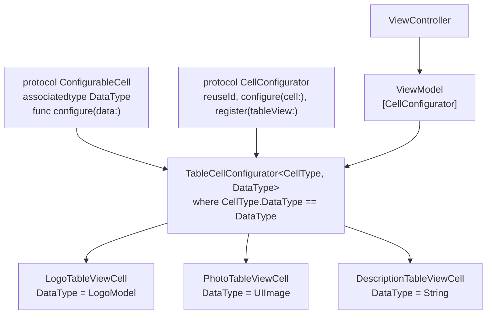
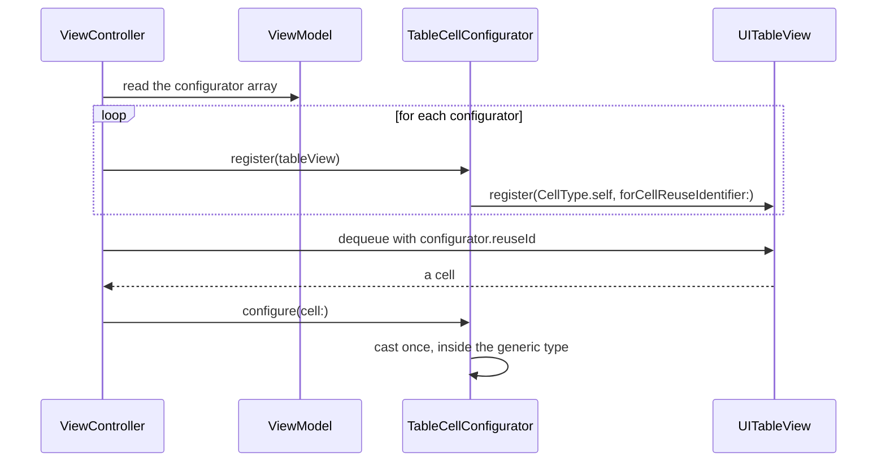

# Generic Table View

*Type safe cell registration and configuration, with no casting at the call site.*

    

## Overview

A table view that mixes logo, photo and description cells. The usual approach is a switch statement
full of `as!` casts. This project removes the casts entirely by making the relationship between a
cell and its data a compile time fact.

## The mechanism



The generic constraint `CellType.DataType == DataType` is what makes this work. It tells the compiler
that a configurator can only ever pair a cell with the data type that cell declared, so a mismatch is
a build error rather than a crash.

## Registration and dequeue



The single cast that remains lives inside the generic configurator, where the constraint guarantees
it succeeds. Call sites never see it.

## Implementation notes

- **The array is heterogeneous, the elements are not.** `[CellConfigurator]` holds configurators of
  different concrete types behind a protocol, while each one stays fully typed internally.
- **Registration derived from the type.** The reuse identifier comes from the cell type itself, so it
  cannot drift out of sync with the registration.
- **Adding a cell type is additive.** A new cell conforms to `ConfigurableCell` and appears in the
  array. No existing code changes.

## Project structure

```
GenericsTableView/
├── CellConfigurator.swift        the protocols and the generic configurator
└── MainModule/
    ├── Models/       LogoModel
    ├── Views/
    │   ├── Cells/    LogoTableViewCell, PhotoTableViewCell, DescriptionTableViewCell
    │   └── ViewModels/ ViewModel
    └── ViewController.swift
```

## Requirements

Xcode 15 or later, iOS 18.0 or later. No external dependencies.
